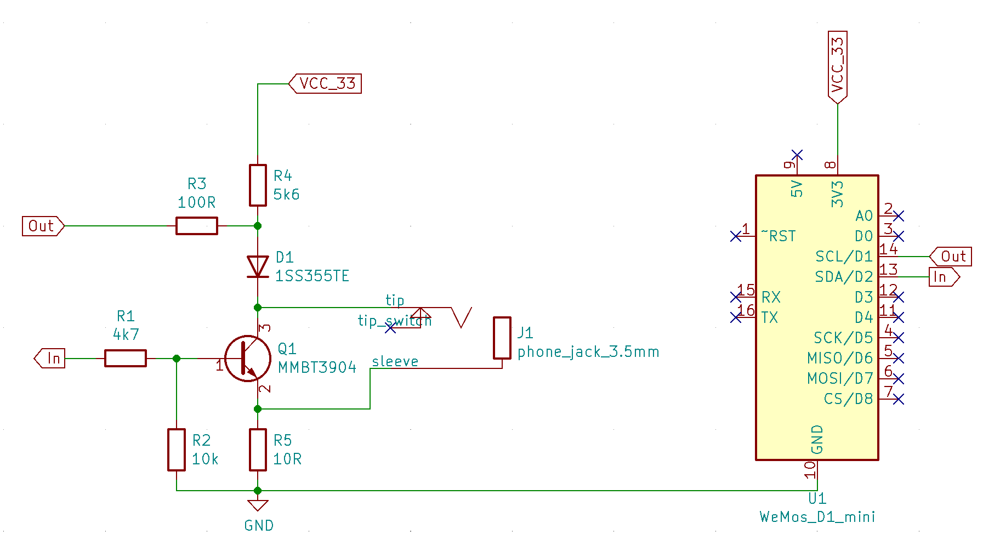
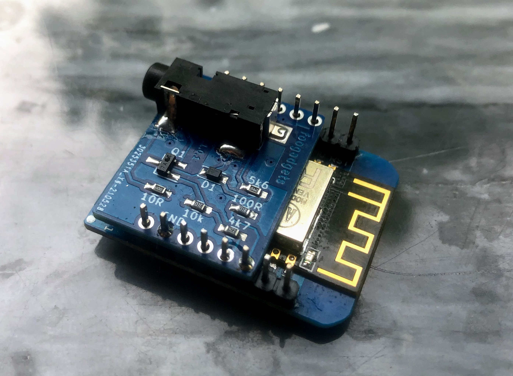
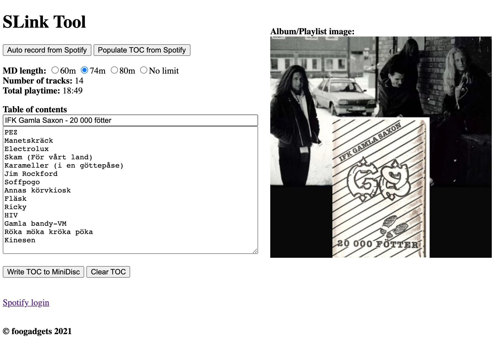

# SLink Tool
[](./LICENSE)

Recording robot to record from Spotify to Sony MiniDisc recorders featuring S-Link port.

----

## Installation
### Prerequisites
#### Basic
* ArduinoJson
* arduinoWebSockets
* spotify-api-arduino (foogadgets fork)
* Sony_SLink (foogadgets fork)
* MusicAlbumTOC (foogadgets)

#### Advanced user
* node.js
* Webpack (nodejs)

### Preparations

Install Arduino IDE  
Install Arduino libraries  
```
 $> cd Arduino/libraries/
 $> git clone https://github.com/foogadgets/spotify-api-arduino.git
 $> git clone https://github.com/foogadgets/Sony_SLink.git
 $> git clone https://github.com/foogadgets/MusicAlbumTOC.git
```
  
Tools -> Manage Libraries etc.  
Search for ArduinoJson and install the package.  
Search for arduinoWebSockets and install the package.  
  
Install the slinktool code in your workspace,  
```
$> cd <your workspace>
$> git clone https://github.com/foogadgets/slinktool.git
$> cd slinktool/
```
  
Install node.js environment for the slink project  
```
 $> cd html-generator/
 $> npm install
 $> npm run build
 $> ./gen_compact_index_file.sh
 $> cd ..
```
  
Start Arduino IDE and open slinktool.ino  

Go to menu Arduino -> Preferences and paste following,  
Additional Boards Manager URLs:  
http://arduino.esp8266.com/stable/package_esp8266com_index.json
Press OK  

Go to Tools -> Board -> Boards Manager…  
Search for esp and install esp8266  

Go to Tools -> Board -> ESP8266 Boards -> LOLIN(WEMOS) D1 R2 & mini

(på OS X behöver man installera egen python3. Det gjorde jag med hjälp av Homebrew. Homebrew kräver dessutom Java JDK samt att jag behövde justera sökvägen till python3 i espressif i filen platform.txt)

Update the wifi credentials in Credentials.h

Build and flash to LOLIN(WEMOS) D1.

Build and upload sketch to your LOLIN.

## SLink hardware interface
Schematics,


The module mounted on the LOLIN D1,


For a bare PCB module that fits LOLIN module, please contact me at, https://www.facebook.com/foogadgets

## Using SLink Tool

Browse to http://slinktool.local/  
Main page,  


To be able to automatically populate album and track data and to automatically record from Spotify you need to be a Spotify Premium user.

Login on this page, https://developer.spotify.com/dashboard/login

1. Create an App
     App name and description is not important.

1. Go into you new App and add a redirect uri by pressing "Edit Settings"
    add "http://slinktool.local/callback" as a Redirect URI and Save

1. Go to http://slinktool.local/login and feed in you Applications
    Client ID and Client Secret and click Login and click the link.

Now continue to, http://slinktool.local/

Step 1 and 2 is only needed to be done once.  
Step 3 need to be done every time the ESP8266 is rebooted.

Enjoy!
